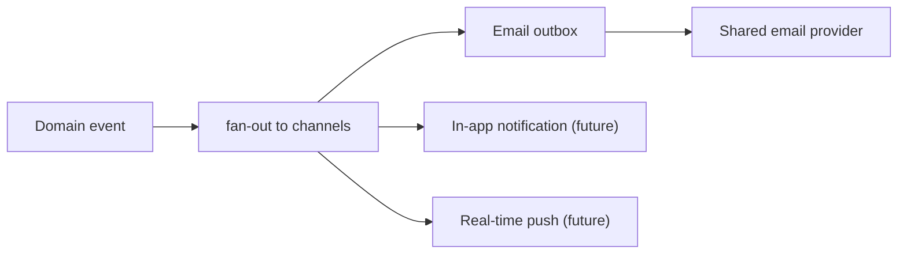
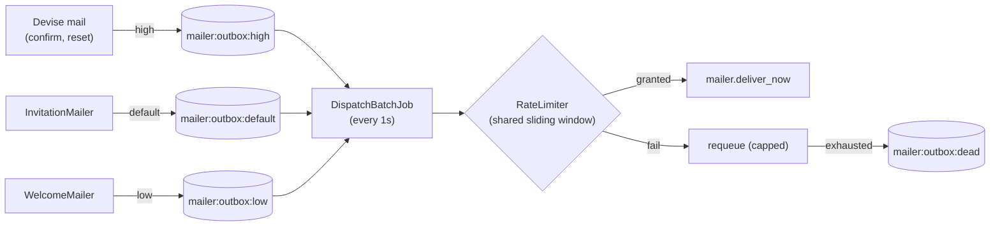
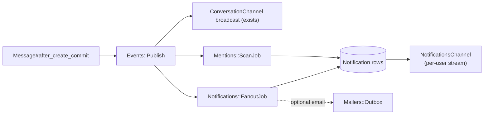

# Centralized Email + Notification System (Fan-out)

This document describes Code Nest's approach to delivering email and (in a
future phase) in-app notifications using a fan-out architecture. It covers the
email egress that is **implemented today** and the notification/mention layer
that is **designed but not yet built**.

## Why fan-out

A single domain event (a signup, an invitation, a new message, a mention)
often needs to reach a user through several independent channels: email, an
in-app notification, a real-time websocket push, or a third-party
integration. Fan-out means one event publishes to many independent consumers
that run concurrently and fail/retry on their own, so a slow or failing
channel never blocks the others or the originating request.

A second, separate concern is the **shared email provider**. Its rate limit is
global to our account, not per email type. If every feature called the
provider directly, they would collectively blow past that limit with no
coordination. So all email funnels through one buffered, rate-limited egress.



## Part 1 - Email egress (implemented)

All outbound application email is buffered in Redis and drained by one
scheduled job behind a shared rate limiter.



### Components

| Concern | Class | File |
|---------|-------|------|
| Enqueue API + priority tiers | `Mailers::Outbox` | [app/services/mailers/outbox.rb](../app/services/mailers/outbox.rb) |
| Provider-wide rate limiter | `Mailers::RateLimiter` | [app/services/mailers/rate_limiter.rb](../app/services/mailers/rate_limiter.rb) |
| Batch drainer | `Mailers::DispatchBatchService` | [app/services/mailers/dispatch_batch_service.rb](../app/services/mailers/dispatch_batch_service.rb) |
| Scheduler entry point | `Mailers::DispatchBatchJob` | [app/jobs/mailers/dispatch_batch_job.rb](../app/jobs/mailers/dispatch_batch_job.rb) |
| Shared Redis pool | `REDIS_POOL` | [config/initializers/redis.rb](../config/initializers/redis.rb) |

### The outbox

`Mailers::Outbox.enqueue(MailerClass, :action, *args, priority:)` appends a
mailer invocation to one of three Redis lists (`mailer:outbox:high`,
`:default`, `:low`). The payload stores the mailer class, action, and
arguments serialized with `ActiveJob::Arguments` — the same mechanism
`ActionMailer::MailDeliveryJob` uses — so ActiveRecord arguments round-trip
through GlobalID.

```ruby
Mailers::Outbox.enqueue(WelcomeMailer, :welcome, user, priority: :low)
```

Producers `RPUSH` to the tail and the drainer `LPOP`s from the head, giving
FIFO order within a tier.

### The rate limiter

`Mailers::RateLimiter` is a sliding-window log over a Redis sorted set
(`mailer:rate`): expired members are trimmed each call, and `acquire(n)`
grants only up to the window's remaining headroom. It is shared by the whole
system, so total throughput respects the provider's global limit regardless
of how much mail is queued.

Configuration (ENV):

| Variable | Default | Meaning |
|----------|---------|---------|
| `MAILER_RATE_LIMIT` | `25` | Max sends per window |
| `MAILER_RATE_WINDOW_SECONDS` | `1` | Window length |
| `MAILER_DISPATCH_MAX` | `25` | Hard cap of sends attempted per tick |
| `MAILER_BACKOFF_SECONDS` | `30` | Global cooldown after a fully-failed tick |

These defaults are tuned to a strict provider ceiling of **25 emails/second**: a
1-second window with a limit of 25, drained by a 1-second tick whose per-tick cap
also equals 25. Aligning the tick interval to the window is what makes the rate
smooth (a steady ~25/s) rather than bursty; a longer tick would force either a
burst of `25 × ticks` at once or under-delivery.

Because there is a single drainer today, a sliding-window log is sufficient
and needs no Lua. If we ever run multiple concurrent drainers, this should be
upgraded to an atomic Lua token bucket.

### The drainer

`Mailers::DispatchBatchJob` runs every 1 second via sidekiq-scheduler (see
[config/sidekiq.yml](../config/sidekiq.yml)). Each tick `Mailers::DispatchBatchService`:

1. Skips entirely while a global backoff is in effect.
2. Asks the rate limiter for a budget = `min(MAILER_DISPATCH_MAX, total_queued)`.
3. Allocates the budget across tiers with a two-pass, priority-weighted
   scheme (`high 0.6 / default 0.3 / low 0.1`): a first weighted pass reserves
   headroom for lower tiers so they cannot starve, then leftover budget
   cascades down in priority order so `high` still gets first claim on spare
   capacity.
4. Sends each payload with `deliver_now`. Transient failures are re-queued to
   the tail with a bumped retry counter; once `Outbox::MAX_RETRIES` is
   exceeded the payload is moved to `mailer:outbox:dead` and reported to
   Sentry. A payload whose record was deleted (`ActiveJob::DeserializationError`)
   is dropped immediately.
5. If every send in a tick fails, a short global backoff is engaged so we stop
   hammering a struggling provider.

### Priority mapping

| Tier | Mail | Rationale |
|------|------|-----------|
| `high` | Devise confirmation, password reset, unlock | Transactional; users wait on them |
| `default` | Invitations | Important but not blocking a live flow |
| `low` | Welcome, future digests/marketing | Bulk; tolerant of delay |

### Latency trade-off

Buffering adds up to one tick (~1s) of latency to every email, including
transactional Devise mail in the `high` tier. This is an accepted trade-off
for a single coordinated egress. If a tighter SLA is needed for transactional
mail, options are to shorten the tick, run a dedicated faster tick for `high`,
or give the `high` tier a direct fast lane that still passes through the
rate limiter.

### Call sites migrated onto the outbox

- `User#send_devise_notification` -> `high` ([app/models/user.rb](../app/models/user.rb)).
- `Invitations::CreationFacade` -> `default` ([app/facades/invitations/creation_facade.rb](../app/facades/invitations/creation_facade.rb)).
- `Mailers::EnqueueWelcomeEmailService` -> `low`, triggered by `User#after_create_commit` ([app/services/mailers/enqueue_welcome_email_service.rb](../app/services/mailers/enqueue_welcome_email_service.rb)).

### Testing

The test environment points `REDIS_POOL` at a single in-memory `MockRedis`
([config/initializers/redis.rb](../config/initializers/redis.rb)), so outbox
and rate-limiter specs exercise real list/sorted-set semantics without a
running Redis server.

## Part 2 - Notifications and mentions (future phase)

Not yet implemented. The intended design extends the same fan-out principle to
in-app notifications and real-time delivery.



Planned pieces:

- `Events::PublishService` - a small registry mapping a domain event name to a
  set of subscriber jobs, each enqueued onto its appropriate Sidekiq queue so
  handlers run concurrently.
- `Notification` model - the in-app notification record (recipient, actor,
  notifiable, kind, read state), written per recipient.
- `NotificationsChannel` - a per-user Action Cable stream mirroring the
  participation gating used by `ConversationChannel`
  ([app/channels/conversation_channel.rb](../app/channels/conversation_channel.rb)).
- `Mentions::ScanJob` - parses `@handles` out of `Message#body` and emits a
  `user.mentioned` event per mentioned user.
- Per-recipient fan-out for group messages, inserting notifications in bulk and
  optionally enqueuing email through `Mailers::Outbox`.

Design notes for that phase:

- Publish from `after_*_commit` hooks (never inside the transaction) so
  subscribers never observe uncommitted data, consistent with the existing
  `Message` and `User` triggers.
- Make per-recipient notifications idempotent via a uniqueness key
  (`[user_id, notifiable, kind]`) since jobs retry.
- Route real-time/websocket work to the `critical` queue and email to
  `mailers` so a slow provider cannot delay an in-app badge.
- Each distinct external provider (email, SMS, push) gets its own rate
  limiter; only the shared email provider uses the single limiter above.
